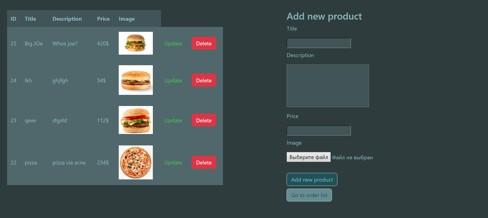
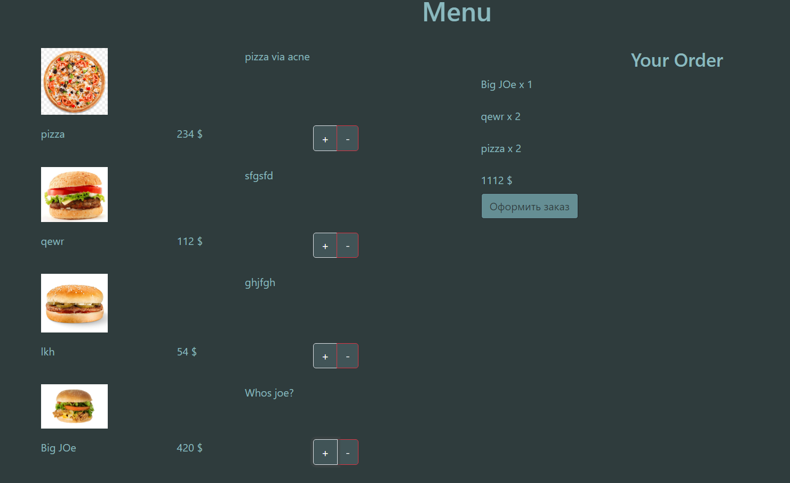
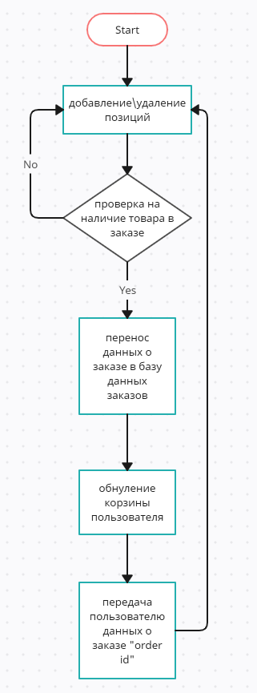
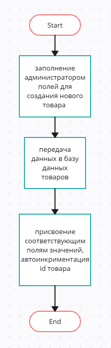
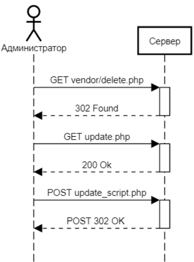

# Отчёт о курсовой работе
#### *По курсу "Основы Программирования"*
#### *Работу выполнил студент группы №3131 Баглаенко Е.Ю.*
[Ссылка на GitHub](https://github.com/scifipunk/cw.git)

[Ссылка на сайт](http://a0767067.xsph.ru/user/user.php)
## Изучение предметной области

Необходимо реализовать "Киоск заказа в ресторане. Система включает в себя интерфейсы для выбора блюд и получения номера очереди. Админский интерфейс позволяет редактировать каталог блюд.".

## Составление ТЗ

- Базовая система вывода списка блюд, их характеристик
- Базовая система добавления/редактирования блюд, их характеристик
- Возможность создания заказа с определенными позициями
- Подключение Yandex Maps API для вывода карты с "ближайшими ресторанами сети"

## Выбор технологий

#### *Платформа:*
Бесплатный хостинг **free.sprinthost.ru**. 

#### *Среда разработки:*
Visual Studio Code.

#### *Языки программирования:*
PHP, HTML, JavaScript.

## Реализация

### Пользовательский интерфейс:
- *Страница администратора:*                                                                                           
  

- *Меню ресторана*                                                                                                        
  

### Пользовательские сценарии:

1) Пользователь заходит на сайт, сразу же попадает на главную страницу с меню ресторана *(user.php)* , а так же все рестораны сети в городе. Пользователь выбирает позиции, добавляя их в заказ, полный список которого и сумму он может наблюдать в правой части страницы. После подтверждения оформления заказа пользователь попадает на страницу *(order.php)*, где он может увидеть номер своего заказа и сам заказ.

2) Администратор попадает на страницу *admin.php*, на которой представлена таблица, содержащая всю информацию о позициях меню вместе с кнопками редактирования и удаления конкретной позиции. Также в правой части экрана администратор может добавить новую позицию в меню. Под формой добавления заказа находится кнопка, переходя по которой администратор попадает на страницу содержащую таблицу заказов клиентов *(order.php)*. Рядом с каждой позицией заказа есть кнопка, позволяющая удалить данный заказ после его выполнения.

### API сервера:

При оформлении заказа пользователя используются **POST**-запросы c полями *user_id*, *dish_id*, *count*.
При добавлении/удалении позиций в меню используются **GET**-запросы.

Для обновления информации на странице *(при удалении позиции из меню или из списка заказов, при добавлении товара в заказ)* используются такие функции как *$.ajax* и *fetch()*.

Также были подключены *Yandex.Maps* , с помощью которых на страницу главного меню была выведена интерактивная карта. 

### Хореография

**order.php**, при отсутствии переменной $_SESSION['user'], перенаправляет пользователя на страницу **user.php**. Если переменная есть, то перенаправление не происходит и отображается заказ пользователя. Возврат в меню *(* на *user.php)* происходит по кнопке **"Main menu"**.

Со страницы **user.php**, при нажатии кнопок **"+"** или **"-"**, сервер отправляет запрос на **add_to_order.php** **, передавая туда введённые в поля **"ID"**, **"Name"**, **"Description"** данные, а с помощью функции *fetch()* происходит изменение данных на странице без ее обновления. При нажатии **"Оформить заказ"**, происходит переход на страницу **order.php**.

При нажатии кнопки **"Delete"** на странице **admin.php** с помощью функции *$.ajax* отправляется GET-запрос на удаление товара из БД со всему товарами и из таблицы на странице. При нажатии кнопки **"Update"** на странице **admin.php** происходит перенаправление на страницу  **update.php**, на которой находится форма, позволяющая изменить данные товара.

Форма добавления товара справа отправляет данные POST-запросом, пересылая не только поля   **"Name"**, **"Description"**, **"Price"**, но и данные глобальной переменной **$_FILES**. С помощью последний на сервер загружается изображение товара.

### Структура базы данных

Браузерное приложение phpMyAdminДля используется для просмотра содержимого базы данных. Всего 3 таблицы:

Первая таблица для хранения данных о товарах:
1. "id" типа int с автоинкрементом для выдачи уникальных id всем товарам
2. "name" типа varchar для хранения названия товара
3. "description" типа varchar для хранения описания товара
4. "img" типа varchar для хранения пути к изображению

Вторая таблица для хранения данных о корзине пользователя:
1. "user_id" типа int для привязки позиций в заказе к id пользователя
1. "dish_id" типа int для определения блюда, которое пользователь добавил в заказ
1. "count" типа int сдля определения количества блюд

Третья таблица для хранения данных о заказе пользователя:
1. "id" типа int с автоинкрементом для выдачи уникальных id заказов всем пользователям
2. "orderprice" типа int для хранения даных о стоимости заказа

### Алгоритмы
1. Алгоритм оформления заказа                                                                                                                             

2. Алгоритм добавления товара                                                                         

### Примеры HTTP-запросов
1. Запросы между пользователем и сервером                                                                                                                           

2. Запросы между администратором и сервером                                                                              

### Значимые фрагменты кода
**Редакттирования данных заказа**:

   ~~~ 
   if(isset($_POST['pl'])) {
    $id_dish = $_POST['pl'];
    $user_id = $_POST['user_id'];
    $sql = mysqli_fetch_assoc(mysqli_query($connect, "SELECT * FROM  `basket` WHERE `user_id` = '$user_id' AND `dish_id` = '$id_dish'"));
    if($sql){
        mysqli_query($connect, "UPDATE `basket` SET `count` = `count` + 1 WHERE `user_id` = '$user_id' AND `dish_id` = '$id_dish'");
    } else {
        mysqli_query($connect, "INSERT INTO `basket` (`user_id`, `dish_id`, `count`) VALUES ('$user_id', '$id_dish', '1')");
    }
}

if(isset($_POST['mn']))
{
    $id_dish = $_POST['mn'];
    $user_id = $_POST['user_id'];
    $sql = mysqli_fetch_assoc(mysqli_query($connect, "SELECT * FROM  `basket` WHERE `user_id` = '$user_id' AND `dish_id` = '$id_dish'"));
    if($sql){
        mysqli_query($connect, "UPDATE `basket` SET `count` = `count` - 1 WHERE `user_id` = '$user_id' AND `dish_id` = '$id_dish'");
    }
}
   ~~~

**Отображение данных заказа**:
~~~
 document.getElementById("pl<?php echo $prod_id ?>").addEventListener('click', function() {
          let newdata = new FormData();
          let pl = <?php echo $prod_id ?>,
              user_id = <?php echo $user_id ?>,
              dish_name = '<?= $dish_name['name']; ?>',
              dish_count = count<?= $prod_id?>;

          newdata.append('pl', pl);
          newdata.append('user_id', user_id);

        fetch("http://localhost/user/vendor/add_order.php", {method: 'POST', body: newdata})
        .then(function() {
        let element = document.getElementById("orderpos"+pl);
        let elspan = document.getElementById("orderamount"+pl);
        if (element){
              elspan.innerHTML++;                      
        }
        else {
              let base = document.getElementById("sum");
              let newDiv = document.createElement("div");
              newDiv.id = "orderpos"+pl; 
              newDiv.innerHTML = dish_name + ' x ';
              
              newSpan = document.createElement("span");
              newSpan.id = "orderamount"+pl; 
              newSpan.innerHTML = 1;
              newDiv.insertAdjacentElement('beforeend',newSpan);
              let br = document.createElement('br');  
              newDiv.append(br);
              base.prepend(br);                                         
              base.prepend(newDiv);
              }

        })
    })
~~~
**Функция вывода сообщений**:
~~~
    $(document).ready(function() {

    $("button").click(function(){
        var postid1 = $(this).data('id');
        
        var id = $("#input" + postid1).val(); 
        
        $.ajax ({
            type: "GET", 
                url: "vendor/delete_order.php", 
                dataType: 'html',
                data: {"id": id}, 
                cache: false, 
                success: function(){ 
                  let elems = document.querySelectorAll('#elem' + id);
                  for (let elem of elems) {
                          elem.remove();
          }
        }});
})
})
~~~
Функция вывода карты:
~~~
    

~~~
## Поддержка
Не требуется. Логов нет, администрирование осуществляется через хостинг.
